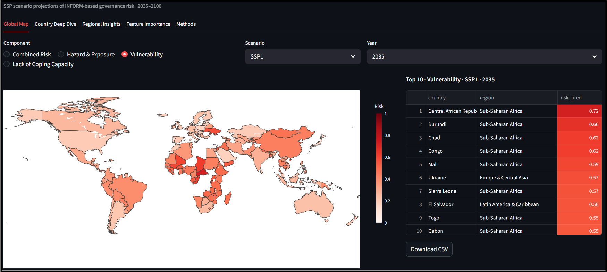

# 🌍 Global Risk Explorer – INFORM Risk Prediction

Global governance-related risks are evolving in response to changing socioeconomic conditions. Understanding how these risks develop and what drives them, is essential for anticipating future challenges.
This project explores how global governance-related risk **(INFORM Risk)** evolves under different **Shared Socioeconomic Pathways (SSPs)** by combining the **INFORM Risk framework** with **future socioeconomic projections**. Instead of treating risk as a black box, the approach models its three core components, Hazard & Exposure, Vulnerability, and Lack of Coping Capacity, using an **XGBoost regression model** to generate scenario-based predictions for countries worldwide.

The results are brought to life in an interactive dashboard, allowing users to explore how risk shifts across **scenarios (SSP1–SSP5), time (2035–2100), and regions**, and to understand the drivers behind these changes.

## What is INFORM Risk?
The INFORM Risk Index is a widely used composite indicator that measures the risk of humanitarian crises and disasters. It is based on three core components:

- **Hazard & Exposure** – likelihood of natural hazards and population exposure  
- **Vulnerability** – susceptibility of populations (e.g., socioeconomic conditions)  
- **Lack of Coping Capacity (LoCC)** – ability of institutions to manage crises  

The overall risk is computed using a geometric aggregation:

> **Risk = (Hazard × Vulnerability × LoCC)^(1/3) / 10**

Each component is predicted on the INFORM 0–10 scale; dividing by 10 normalises the composite score to 0–1. This ensures equal contribution of all three dimensions while preserving their multiplicative relationship — a country can only achieve a low composite score if all three components are simultaneously low. This project follows this structure by modeling each component separately and then combining them into a final risk score.

# Project Goal
The goal is to build a transparent and reproducible pipeline to:

- Predict future INFORM risk under different SSP scenarios  
- Understand key drivers of risk across countries  
- Provide an interactive way to explore results  

# Modeling Pipeline
To predict INFORM Risk via its three components (Hazard & Exposure, Vulnerability, Lack of Coping Capacity), each component follows the same structured workflow. The steps below describe the pipeline and script order used during development.

1. **Feature Preparation**  
   - Combine historical data with SSP projections  
   - Test different feature sets (`feature_set_test.py`)

2. **Utilities (`*_utils.py`)**  
   - Data loading & preprocessing  
   - Split-safe interpolation  
   - Lagged feature creation  
   - Temporal & spatial validation setup  
   - Model + tuning helpers  

3. **Model Tuning & Validation (`tune_validate_model.py`)**  
   - Models: Random Forest, XGBoost, MLP  
   - Validation:
     - Rolling temporal validation  
     - Grouped spatial cross-validation  
   - Output: best model + hyperparameters  

4. **Final Training (`train_model.py`)**  
   - Train model on full dataset  
   - Save model, metadata, feature importance  

5. **Model Explanation (`explain_model_shap.py`)**  
   - Compute SHAP values  
   - Identify key drivers  

6. **Prediction (`predict_*.py`)**  
   - Load trained model + SSP features  
   - Create lagged features  
   - Predict future values  

6. **Evaluation & Visualization (`Plot_*_pred_vs_actual.py`)**
   - Compare predicted vs. actual values  
   - Generate evaluation plots 

After generating predictions for all three components, the final INFORM Risk score is computed by running:
```bash
python src/compute_risk_index.py
```

# Dashboard
The results are visualized using an **interactive dashboard built with Streamlit**. The dashboard allows users to explore:

- 🌍 Global risk distribution by component (map view)
- 🏳️ Country-level trends
- 📊 Regional comparisons
- 🔍 Scenario analysis (SSP1, SSP2, SSP3, SSP5)
- 📈 Feature importance
- 📅 Time horizon: **2035–2100**



# Project Structure
```bash
global-risk-explorer/
│
├── dashboard/              # Streamlit app
│   ├── app.py
│   └── visualization.py
│
├── data/
│   ├── raw/                # Raw input datasets
│   ├── processed/          # Cleaned & feature-engineered data
│   ├── predictions/        # Model predictions (used by dashboard)
│   ├── models/             # Saved model artifacts
│   └── results/            # SHAP outputs / plots
│
├── src/
│   ├── hazard/             # Hazard & Exposure modeling
│   ├── vulnerability/      # Vulnerability modeling
│   ├── lack_of_coping_capacity/  # LoCC modeling
│   └── compute_risk_index.py     # Final risk computation
│
├── requirements.txt
├── README.md
└── .gitignore

```
## Data & Usage
The repository does not include raw datasets due to size and reproducibility considerations.
Instead, it provides all **processed datasets** required to run the modeling pipeline.
This allows the full pipeline (training, validation, prediction, and risk computation) to be reproduced without additional preprocessing.  
Re-running the entire pipeline is not necessary, as the provided outputs and dashboard already allow direct exploration of the results.

# Installation
Create a virtual environment and install dependencies:
```
python -m venv .venv
.venv\Scripts\activate   # Windows
# source .venv/bin/activate  # Mac/Linux

pip install -r requirements.txt
```

# Running the Dashboard
From the project root:
```
streamlit run dashboard/app.py
```
Then open:
```
http://localhost:8501
```

