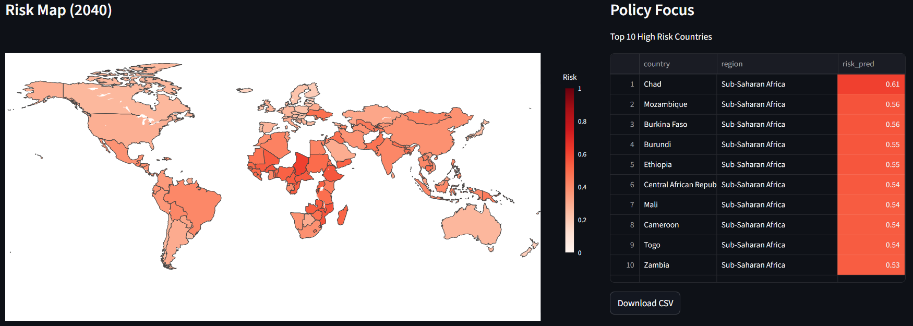

# Global Risk Explorer – INFORM Risk Prediction

This project predicts future **INFORM Risk** by modeling its three components separately:

- **Hazard & Exposure**
- **Vulnerability**
- **Lack of Coping Capacity (LoCC)**

The final INFORM Risk score is computed from the predicted component values.

---

## Overview

Instead of predicting INFORM Risk directly, this project follows the original INFORM logic:

**historical data + SSP features → predict components → compute INFORM Risk**

This improves:
- interpretability
- model transparency
- analysis of individual risk drivers

---

## Modeling Pipeline

Each component is modeled using the same workflow:

1. **Feature Preparation**  
   - Combine historical data with SSP projections  
   - Test different feature sets (`feature_set_test.py`)

2. **Utilities (`*_utils.py`)**  
   - Data loading & preprocessing  
   - Split-safe interpolation  
   - Lagged feature creation  
   - Temporal & spatial validation setup  
   - Model + tuning helpers  

3. **Model Tuning & Validation (`tune_validate_model.py`)**  
   - Models: Random Forest, XGBoost, MLP  
   - Validation:
     - Rolling temporal validation  
     - Grouped spatial cross-validation  
   - Output: best model + hyperparameters  

4. **Final Training (`train_model.py`)**  
   - Train model on full dataset  
   - Save model, metadata, feature importance  

5. **Model Explanation (`explain_model_shap.py`)**  
   - Compute SHAP values  
   - Identify key drivers  

6. **Prediction (`predict_*.py`)**  
   - Load trained model + SSP features  
   - Create lagged features  
   - Predict future values  

---

## Validation Strategy

Two complementary approaches:

- **Temporal validation** → predicts future years  
- **Spatial validation** → generalizes across countries  

This ensures realistic model performance.

---

## Feature Engineering

- Uses **lagged features** (predict year *t* using *t-1*)  
- Handles missing data with **split-safe interpolation** (no data leakage):
  - linear interpolation  
  - backward / forward fill (small gaps only)  

---

## Running the Project

For each component, run scripts in this order:

1. `feature_set_test.py`  
2. `*_utils.py`  
3. `tune_validate_model.py`  
4. `train_model.py`  
5. `explain_model_shap.py`  
6. `predict_*.py`  

Repeat for:
- Hazard & Exposure  
- Vulnerability  
- LoCC  

---

## Final Output

Predicted component values are combined to compute:

**Future INFORM Risk**